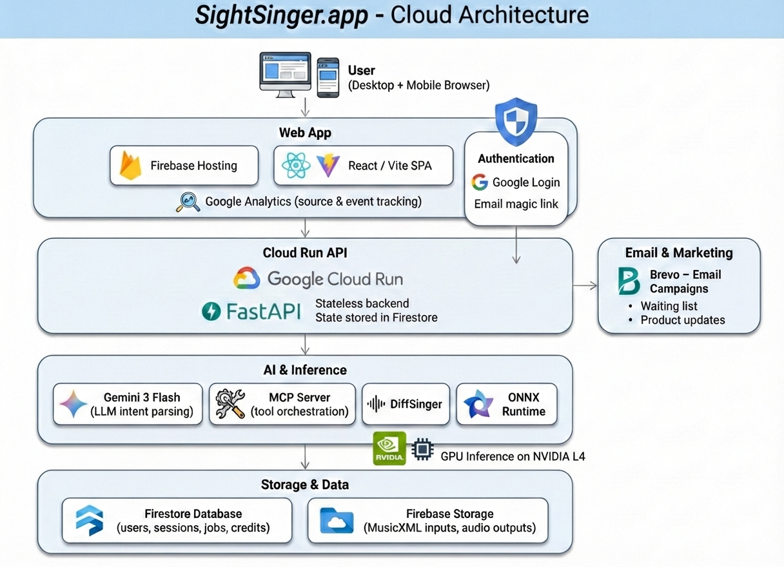

# SightSinger.app

AI sight-singing from MusicXML, via AI chat. No DAW required.

## What it’s for

- **Indie Songwriters**: instant vocal demos without a session singer or professional DAW mockup.
- **Choir & Worship Leaders**: quick SATB parts or melody practice tracks.
- **Beginner Singers**: try singing with a score-accurate guide before investing in lessons.
- **Quick Song Learners**: learn a few songs fast without diving into theory or breath training.

## How it works

1. Upload MusicXML
2. Tell the AI how would you like to sing
3. AI interprets your request and calls the API through MCP server to synthesize the audio
4. Chat to iterate quickly, render new takes, and share the demo with others

## SightSinger.app is NOT

- A DAW replacement
- A human vocalist
- A song generator (text-to-music)
- A voice converter

## What’s in this repo

```
marketing/               # Next.js marketing site (App Router)
ui/                      # React/Vite app frontend
src/backend/             # FastAPI backend + orchestration
src/api/                 # DiffSinger pipeline (parse/synthesize)
src/mcp_server.py        # MCP server (stdio JSON-RPC)
assets/voicebanks/       # Local voicebanks for dev
tests/                   # End-to-end and unit tests
```

## Architecture diagram



## Local development

Backend (Docker):
```bash
docker build -t sightsinger-backend .
docker run --rm -p 8080:8080 \
  -e GEMINI_API_KEY=your_key_here \
  sightsinger-backend
```

Marketing (Next.js):
```bash
cd marketing
npm install
npm run dev
```

App frontend (Vite):
```bash
cd ui
npm install
npm run dev
```

URLs:
- Marketing: `http://localhost:3000/`
- App: `http://localhost:5173/`
- App demo: `http://localhost:5173/demo`
- Backend: `http://localhost:8080`

## LLM setup (Gemini or Fake LLM)

By default the backend expects a Gemini API key in the environment:
```bash
export GEMINI_API_KEY=your_key_here
```

If you want to run without calling Gemini, use the fake/static LLM:
```bash
scripts/start_backend_dev_fake_llm.sh
```

You can also force the fake LLM via env vars (useful in Docker):
```bash
export LLM_PROVIDER=static
export LLM_STATIC_RESPONSE="Hello! This is a fake LLM response."
export LLM_STATIC_LOOP=true
```

### Using another LLM provider

The backend currently supports `gemini` and `static` only. To add a new provider:
- Implement a new client that matches the `LlmClient.generate()` protocol (`src/backend/llm_client.py`).
- Add a branch in `src/backend/llm_factory.py` and load any new env vars in `src/backend/config/__init__.py`.
- Ensure the model output matches the JSON schema expected by the orchestrator (tool calls + final response in `src/backend/llm_prompt.py`).

## Demo assets (public)

Scripted demo uses local assets:
```
ui/public/landing/demo/scores/amazing-grace.mxl
ui/public/landing/demo/audio/amazing-grace-soprano.mp3
ui/public/landing/demo/audio/amazing-grace-tenor.mp3
```

## Credits

Voicebank credits live in `CREDITS.md`.

## Voicebanks

Dev (local):
- Place voicebanks under `assets/voicebanks/`

Relevant env:
```
VOICEBANK_BUCKET
VOICEBANK_PREFIX=assets/voicebanks
VOICEBANK_CACHE_DIR=/tmp/voicebanks
```

## MCP Server (stdio JSON-RPC)

Start:
```bash
.venv/bin/python -m src.mcp_server --device cpu
```

Notes:
- Voicebank inputs are **IDs only**.
- Logs go to stderr in MCP mode.

Example call sequence:
```json
{"jsonrpc":"2.0","id":1,"method":"tools/call","params":{"name":"parse_score","arguments":{"file_path":"assets/test_data/amazing-grace-satb-verse1.xml"}}}
```

## Tests

End-to-end synthesis:
```bash
.venv/bin/python -m pytest tests/test_end_to_end.py -k test_full_synthesis -vv
```


## Docs

- `architecture.md` – current system architecture
- `deployment_architecture.md` – deployment design and ops notes
- `api_design.md` – API design spec

## License

PolyForm Noncommercial License 1.0.0. See `LICENSE`.
