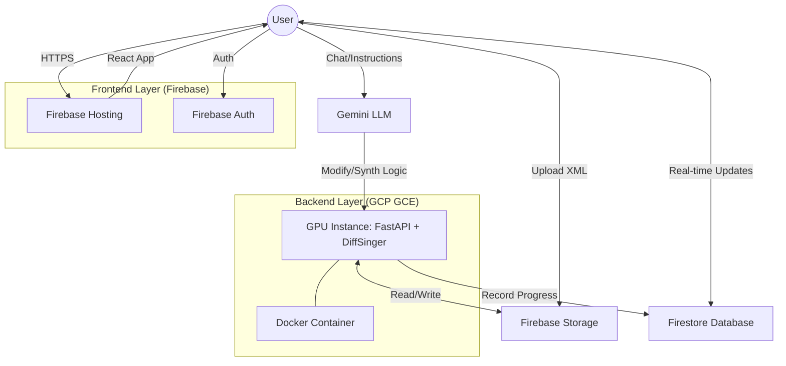

# AI Singer Deployment Architecture (Demo)

This document outlines the hybrid deployment strategy for the AI Singer project, combining **Firebase** for serverless convenience and **GCP Compute Engine** for high-performance GPU inference.

## Overview

The architecture split ensures the app is responsive, scalable, and cost-effective (using GCP credits).

## Component Details

### 1. Frontend: Firebase Hosting
- **Tech**: React / Vite.
- **URL**: `https://ai-singer-diffsinger.web.app` (Example).
- **Features**: Built-in SSL, global CDN, and automatic deployment from CLI.
- **Responsibility**: UI/UX, Score visualization (OSMD), Audio playback, and Auth state.

### 2. Database & Storage: Firebase (GCP-native)
- **Firestore (NoSQL)**:
    - Stores "Job" metadata (status: pending/processing/done).
    - Stores "Score" metadata (user ID, ownership).
- **Firebase Storage (GCS)**:
    - **Source**: Hosts user-uploaded `.musicxml` files.
    - **Result**: Hosts generated `.wav` or `.mp3` files.
    - **Internal Access**: Accessed via the `google-cloud-storage` SDK on the GPU instance (zero latency within the same region).

### 3. Inference Engine: GCP Compute Engine (GCE)
- **Instance Type**: `n1-standard-4` (4 vCPU, 15GB RAM).
- **GPU**: 1x NVIDIA Tesla T4 (using **Spot/Preemptible** for ~70% savings).
- **Connectivity & HTTPS**:
    - **Issue**: Firebase Hosting cannot rewrite traffic to arbitrary GCE IPs.
    - **Solution**: The Frontend will query the Backend directly via `https://api.yourdomain.com`.
    - **HTTPS Implementation**: Run **Caddy Server** on the GCE instance.
        - Caddy automatically provisioned Let's Encrypt SSL certificates.
        - It acts as a reverse proxy, forwarding `:443` (HTTPS) to `:8000` (FastAPI).
        - **Why?**: Browsers block Mixed Content (HTTP requests from HTTPS frontend) and require Secure Contexts for audio APIs.
- **Backend Stack**:
    - **FastAPI**: Exposes REST/WebSocket endpoints.
    - **Uvicorn**: ASGI server.
    - **DiffSinger**: The core AI model.
- **Disk Hygiene**:
    - **Cron Job**: Runs nightly to delete files in `BACKEND_DATA_DIR` older than 24 hours to prevent disk saturation.
- **Port Exposure**: Expose `80`, `443` (Caddy) and secure via Cloud Firewall.

### 4. Intelligence Layer: Gemini LLM
- **Provider**: Google AI (Gemini 1.5 Pro/Flash).
- **Role**: 
    - Analyzes user natural language instructions (e.g., "Transpose this to C major").
    - Interacts with the **Music21 MCP Server** logic to perform structured score modifications.
    - Formulates synthesis parameters for DiffSinger.
- **Secrets Management**:
    - **API Keys**: Store `GEMINI_API_KEY` in **GCP Secret Manager**.
    - **Injection**: Use a startup script to fetch the secret and inject it into the Docker container's environment variables.

## Data Flow (Synthesis Sequence)

1.  **Upload**: User uploads a MusicXML file in the React UI. The UI uploads it to `Firebase Storage`.
2.  **Trigger**: React sends a POST request to the **GCE Backend** with the file path.
3.  **Process**:
    - GCE Backend downloads the MusicXML from Storage.
    - Runs the music21 analysis and lyric transfer logic.
    - Feeds results into **DiffSinger** (GPU Inference).
    - Generates the audio waveform.
4.  **Save**:
    - GCE Backend uploads the generated audio to `Firebase Storage`.
    - Backend updates the `Firestore` document status to "Completed" and provides the public download URL.
5.  **Notify**: React (listening to the Firestore document) detects the status change and loads the local audio player.

## Security
- **Authentication**: GCE backend verifies the Firebase ID Token in the request header using `firebase-admin` SDK.
- **IAM**: GCE Instance uses a specialized **Service Account** with "Storage Object Creator" and "Cloud Datastore User" permissions.

## Cost Optimization (Credits Strategy)
- **Total Credit**: £220.
- **Strategy**: 
    - Always use **Spot Instances** for GCE.
    - **Stop** instances manually when the demo session ends.
    - Use **Firebase Free Tier** (Spark) as much as possible; only switching to Blaze (which uses GCP credits) if storage grows beyond 5GB.
