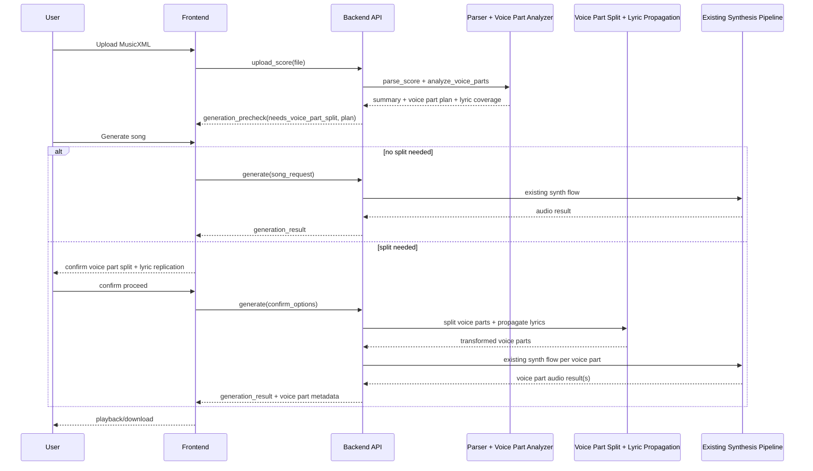

# SIG-6 Voice Part Split and Lyric Replication Sequence Flow

## Scope
This sequence describes the end-to-end flow from:
- user uploads MusicXML
- user requests song generation
- system detects compact multi-voice notation
- user confirms voice part split + lyric replication
- system proceeds through existing synthesis flow

Linear reference: `SIG-6`

## Actors
- User
- Frontend (UI)
- Backend API
- MusicXML Parser / Voice Part Analyzer
- Voice Part Split + Lyric Propagation Module
- Existing Synthesis Pipeline (`align_phonemes_to_notes -> predict_durations -> predict_pitch -> predict_variance -> synthesize_audio`)

## Sequence (Step-by-Step)
1. User uploads a MusicXML file in UI.
2. Frontend sends upload metadata + file to Backend API.
3. Backend stores file and calls `parse_score` (summary mode).
4. Parser returns base score summary and part metadata.
5. Backend runs voice part analyzer on parsed score.
6. Voice Part analyzer detects compact multi-voice part(s) and computes:
- voice part candidates per part
- lyric coverage per voice
- confidence and suggested mapping (for example `P1: soprano=voice1, alto=voice2`)
7. Backend returns a `generation_precheck` response to Frontend:
- `needs_voice_part_split: true/false`
- proposed voice part plan
- lyric replication impact preview (for example voice2 needs propagated lyrics)
8. User clicks `Generate song`.
9. If `needs_voice_part_split=false`, Backend proceeds directly to existing synthesis flow.
10. If `needs_voice_part_split=true`, UI shows confirmation dialog:
- selected voice part(s) to render
- lyric replication policy (strict/assist)
- preview warning for voice parts with no direct lyrics
11. User confirms `Proceed`.
12. Frontend sends confirmed options to Backend:
- target voice part IDs
- replication policy
- optional voice part mapping overrides
13. Backend executes voice part split transform.
14. Backend executes lyric propagation for selected voice parts.
15. Backend validates transformed voice parts:
- monotonic timing
- required lyrics available after propagation
- tie/slur continuity preserved
16. Backend maps each selected voice part to existing synthesis input schema.
17. Backend calls existing synthesis pipeline unchanged per voice part:
- `align_phonemes_to_notes`
- `predict_durations`
- `predict_pitch`
- `predict_variance`
- `synthesize_audio`
18. Backend combines outputs (single voice part or multi-voice part mix) and stores artifacts.
19. Backend returns generation result + debug metadata:
- rendered audio path(s)
- voice part mapping used
- propagated lyric counts and conflict summary
20. Frontend shows playback/download.

## Mermaid Diagram

## Handoff to Existing Flow
After step 16, the remaining synthesis is intentionally unchanged.  
The only new contract is: synthesis receives a clean monophonic voice part stream with resolved lyric tokens.

## Error Paths
- Voice Part detection low confidence:
  - UI asks user to pick voice part mapping manually.
- Propagation cannot create singable lyrics for a requested voice part:
  - strict mode: fail fast with actionable error.
  - assist mode: continue with warning if policy allows fallback.
- Voice Part validation fails (timing/continuity):
  - stop before synthesis and return diagnostics.
