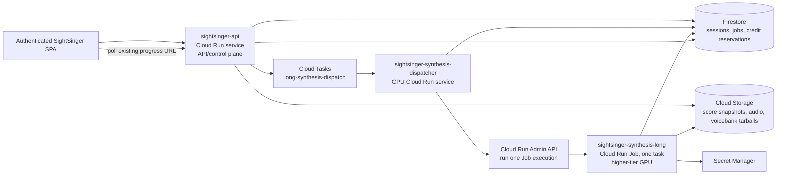

# Long-running GPU synthesis on Cloud Run Jobs

## 1. Decision

Move only long or high-cost DiffSinger renders off `sightsinger-api` and onto a dedicated, GPU-enabled **Cloud Run Job** named `sightsinger-synthesis-long`.

The public API remains the control plane: it authenticates the request, resolves the voice and lyric selection, reserves credits, persists a job record and input snapshot, and returns the existing progress URL. The Cloud Run Job is the data plane: it executes one render, updates the same Firestore job record, writes the output to Cloud Storage, and settles or releases the existing credit reservation.

Use a Cloud Run **Job**, not an HTTP Cloud Run service or a worker pool, for this path:

- an execution has no browser or API request held open while inference runs;
- each execution runs one isolated render and exits;
- GPU-backed Cloud Run jobs support a task timeout of up to one hour;
- the API can launch an execution with a per-render `JOB_ID` override;
- worker pools are persistent pull consumers and do not autoscale themselves, which is unnecessary for the first version.

This design supports work up to the Cloud Run GPU job limit of one hour. A render predicted or observed to exceed that limit is out of scope for this design and must be split into resumable stages or moved to a different compute platform.

## 2. Current problem

Today `sightsinger-api` starts a local asynchronous synthesis task. Its `synthesize` and `save_audio` MCP tools run inside a GPU MCP subprocess. In local development the GPU MCP request timeout is 1,200 seconds. In production, a long render also shares the API service's instance, deployment, and failure domain.

The existing architecture already has the necessary durable boundaries:

- Firestore stores job state and progress;
- Cloud Storage stores score snapshots and audio outputs;
- credit reservations are keyed by the existing logical `job_id` and are idempotent;
- the browser already polls a job progress URL rather than holding synthesis open.

The long-render route should reuse those boundaries rather than create a second job or billing model.

## 3. Target deployment architecture



### Components

| Component | Deployment | Responsibility |
|---|---|---|
| `sightsinger-api` | Existing public Cloud Run service in `us-east4` | Auth, LLM/planning, deterministic route selection, credit reservation, job creation, cancellation API, progress API. It never performs the long render. |
| `long-synthesis-dispatch` queue | Cloud Tasks | Durable, short dispatch trigger. Its HTTP deadline is irrelevant to synthesis because dispatch only starts the Cloud Run Job and returns. |
| `sightsinger-synthesis-dispatcher` | Small private CPU Cloud Run service | Claims queued long jobs, applies an application-level GPU slot limit, starts a Cloud Run Job execution, and records its execution name. |
| `sightsinger-synthesis-long` | Private Cloud Run Job, one task per execution | Downloads the durable input, claims the job, performs inference, publishes progress/output, and settles or releases credits. |
| Firestore and Cloud Storage | Existing managed stores | Canonical state, artifacts, job progress, leases, and billing records. |

The dispatcher is deliberate. Calling the Cloud Run Job directly from the API would work initially, but would not provide an application-level queue or a clear maximum number of simultaneous expensive GPU renders. Cloud Tasks only calls the short dispatcher endpoint; it must not hold an HTTP request open for the render.

## 4. GPU tier and region

### Recommended long-render tier

Deploy `sightsinger-synthesis-long` in `us-central1` with one NVIDIA RTX PRO 6000 Blackwell GPU, 20 vCPU, and 80 GiB memory. This is a materially higher tier than the current L4-class API deployment and is suitable for memory-heavy or slow DiffSinger renders.

The current API deployment script targets `us-east4`. At the time of this design, RTX PRO 6000 Blackwell Cloud Run GPUs are documented in `us-central1`, `europe-west4`, `asia-southeast1`, and `asia-south2`, not `us-east4`. The design therefore accepts cross-region API-to-worker control traffic. Score/audio artifacts must remain in Cloud Storage; do not depend on an API-instance filesystem.

If keeping computation in `us-east4` is more important than the higher GPU model, deploy the long Job there with an L4 and larger host resources (recommend 8 vCPU and 32 GiB). That is a capacity tier, not a higher GPU family. Choose one option during infrastructure approval; do not silently fall back between regions.

### Required job settings

```text
tasks:                         1
parallelism:                   1
task timeout:                  3600 seconds
task retries:                  0
GPU:                           1
GPU zonal redundancy:          disabled (required for GPU Jobs)
execution environment:         second generation
ingress:                       none (Jobs do not expose a public HTTP endpoint)
```

Set the in-container GPU synthesis timeout below the task timeout, for example `MCP_GPU_TIMEOUT_SECONDS=3300`, leaving time for output upload, credit settlement, and failure reporting. The worker must stop gracefully before its remaining task-time budget is exhausted.

## 5. Routing and job lifecycle

### 5.1 Deterministic route selection

The LLM does not choose the deployment tier. After the existing score, part, lyric selection, voicebank, and estimated work are resolved, the backend selects a route:

```text
standard   → current synthesis execution path
long_gpu   → durable long-job workflow
```

Make this policy configuration-driven and record the result in Firestore:

```text
LONG_SYNTHESIS_ENABLED=true
LONG_SYNTHESIS_ROUTE_POLICY_VERSION=1
LONG_SYNTHESIS_ESTIMATED_WORK_THRESHOLD=<benchmark-derived>
LONG_SYNTHESIS_MAX_ACTIVE_JOBS=1
```

Do not set the numeric threshold until representative benchmarks exist. The first policy may route based on an estimated render duration and a conservative score/voicebank complexity signal. Record `routeReason`, estimated work, and policy version so thresholds can be tuned from actual data.

### 5.2 Submission sequence

```mermaid
sequenceDiagram
    participant UI as SPA
    participant API as sightsinger-api
    participant FS as Firestore
    participant Q as Cloud Tasks
    participant D as dispatcher
    participant J as long GPU Job
    participant GCS as Cloud Storage

    UI->>API: synthesize request
    API->>FS: validate + reserve credits (logical jobId)
    API->>GCS: persist immutable score/input snapshot
    API->>FS: create jobs/{jobId}: queued_long
    API->>Q: enqueue {jobId}
    API-->>UI: 202 + existing progress URL
    Q->>D: dispatch jobId
    D->>FS: transaction: claim queue slot and mark dispatching
    D->>J: jobs.run override: JOB_ID=jobId
    D->>FS: persist Cloud Run execution name
    J->>FS: transaction: claim job lease; mark running
    J->>GCS: load snapshot/models; write audio artifact
    J->>FS: progress updates, settle credits, mark completed
    UI->>API: poll progress URL
    API->>FS: return normalized job state
```

The submit transaction must either produce both the durable job record and an outbox/dispatch record, or the API must run a reconciler for `queued_long` jobs that have no task/execution. A failed process after credit reservation must not leave a render permanently undispatched.

### 5.3 Worker contract

The Cloud Run Job container starts `python -m src.backend.synthesis_job_runner` with a per-execution `JOB_ID` environment override. It must:

1. Read `jobs/{jobId}` and claim it with a Firestore transaction. If another execution already owns/completed it, exit successfully without rendering.
2. Verify the immutable input and storage paths belong to the recorded user/session; never accept user paths as execution arguments.
3. Start/own exactly one GPU MCP worker, or preferably call a shared in-process synthesis runner extracted from the MCP handler. It must not start the public FastAPI server.
4. Update the existing job document at meaningful steps: `starting`, `loading_voicebank`, `synthesizing`, `encoding`, `uploading`, `settling`, then a terminal state.
5. Upload audio to the deterministic `jobs/{jobId}` output path before marking it completed.
6. Call the existing settle/release credit operations using the same `jobId`.
7. Release its application GPU slot in a `finally` path.

### 5.4 Firestore job additions

Additive fields on the existing `jobs/{jobId}` document:

```json
{
  "executionMode": "long_gpu",
  "routePolicyVersion": 1,
  "routeReason": "estimated_work_over_threshold",
  "dispatchStatus": "queued|dispatching|started|failed",
  "cloudRunJobName": "sightsinger-synthesis-long",
  "cloudRunExecutionName": "projects/.../executions/...",
  "workerLease": {
    "owner": "cloud-run-execution-name",
    "expiresAt": "timestamp"
  },
  "cancelRequestedAt": "timestamp or null"
}
```

These fields are observability and coordination data; Firestore remains the product-facing source of truth. Do not make the UI depend directly on Cloud Run execution status.

## 6. Failure, retry, and cancellation semantics

| Situation | Required behavior |
|---|---|
| Dispatcher delivery repeats | Firestore claim transaction detects that the logical job is already dispatching/running/completed; the duplicate returns success without launching another render. |
| Job execution repeats or is manually retried | Worker lease and existing credit reservation make the execution idempotent. It must not render or charge twice. |
| GPU task reaches timeout | Worker records a terminal/retryable infrastructure failure before the deadline when possible, releases the slot, and releases the reservation unless reconciliation is required. |
| Worker crashes | Lease expires. A reconciliation process marks the job retryable or failed and handles the existing reservation by its current transactional rules. |
| User cancels | API records `cancelRequestedAt`, calls the Cloud Run execution cancel API when an execution exists, and worker checks the flag between pipeline stages. Credit release follows the existing cancellation path. |
| Output upload succeeds but settlement fails | Preserve the output as today, mark the existing reconciliation state, and do not launch a duplicate render. |

Use **zero Cloud Run Job task retries** initially. Automatic platform retries can be safe only after all stage effects and cancellation semantics are proven idempotent. The product-level retry is a new execution of the same logical job only when the Firestore state explicitly permits it.

## 7. IAM, security, and artifacts

### Service accounts

| Identity | Minimum responsibilities |
|---|---|
| `sightsinger-api` runtime service account | Create Cloud Tasks tasks; execute `sightsinger-synthesis-long` with `JOB_ID` override; read job execution status/cancel it. Grant `roles/run.jobsExecutorWithOverrides` on that one Job, not project-wide Cloud Run Admin. |
| Dispatcher service account | Same narrow Job execution permission, Firestore transaction access, and no public artifact read access. |
| Long-job runtime service account | Firestore job/session/credit access, Storage read for its own input/voicebank prefix and write for its output prefix, Secret Manager access only to synthesis-required secrets. |

The job receives only the opaque `JOB_ID` as an execution override. It receives no Firebase ID token, user email, raw score, credit balance, storage signed URL, or secret through environment variables. It resolves every sensitive value from Firestore/Storage with its runtime identity.

### Artifact policy

- Persist the selected score/lyric snapshot before dispatch. The worker must not read a mutable session score that the user may change after submission.
- Use deterministic, user-scoped input and output paths already reflected by the job record.
- Keep voicebanks in the existing protected Cloud Storage location; cache them only in the Job container's ephemeral filesystem.
- Do not expose the Job or dispatcher publicly. The UI continues to use the authenticated API progress and audio endpoints.

## 8. Deployment plan

### 8.1 Container layout

Build the same application image into two deployable entry points:

```text
sightsinger-api image
  entrypoint: uvicorn src.backend.main:app

sightsinger-synthesis-long image
  entrypoint: python -m src.backend.synthesis_job_runner
```

Both use the existing CUDA-compatible image and voicebank manifests. The worker image may later prepackage the highest-frequency voicebanks if measurements show that Cloud Storage download dominates startup; keep Cloud Storage as the source of truth.

### 8.2 Infrastructure resources

1. Enable Cloud Run Jobs and Cloud Tasks APIs if not already enabled.
2. Create `long-synthesis-dispatch` Cloud Tasks queue with a conservative dispatch rate.
3. Deploy the private CPU dispatcher service in the API region.
4. Deploy `sightsinger-synthesis-long` in the approved GPU region and tier.
5. Grant narrow, resource-level IAM bindings described above.
6. Add a scheduled reconciliation endpoint/job for stale dispatch leases and expired worker leases.
7. Extend the existing backend deployment pipeline with a separately versioned worker image/job deployment step; do not modify the public API service's GPU configuration as part of this rollout.

Illustrative deployment command for the higher-tier option (values require approval and quota validation):

```bash
gcloud run jobs deploy sightsinger-synthesis-long \
  --project=sightsinger-app \
  --region=us-central1 \
  --image=us-central1-docker.pkg.dev/sightsinger-app/sightsinger/synthesis-worker:REVISION \
  --tasks=1 \
  --parallelism=1 \
  --task-timeout=3600s \
  --max-retries=0 \
  --cpu=20 \
  --memory=80Gi \
  --gpu=1 \
  --gpu-type=nvidia-rtx-pro-6000 \
  --no-gpu-zonal-redundancy \
  --service-account=sightsinger-synthesis-long-as@sightsinger-app.iam.gserviceaccount.com
```

### 8.3 Rollout

1. Deploy worker/dispatcher with routing disabled; execute a known fixture manually and verify Firestore, Storage, and credit settlement.
2. Enable routing for an allowlisted internal account and one voicebank/fixture class.
3. Compare output, credits, latency, GPU startup time, and failure recovery with the existing route.
4. Enable a conservative benchmark-derived threshold.
5. Add quota/queue alarms before expanding the threshold.

A rollback is configuration-only: disable `LONG_SYNTHESIS_ENABLED`. Already-started jobs continue on their worker; queued jobs may be cancelled or returned to the standard route only if they have not begun and the credit reservation remains valid.

## 9. Observability and acceptance criteria

Emit structured logs and metrics keyed by `jobId`, Cloud Run execution name, route, voicebank, and worker stage. Never log lyric text, user email, raw score content, access tokens, or signed URLs.

Required metrics:

- queue wait, dispatch latency, execution startup, model/voicebank load, inference, encoding, upload, and settlement durations;
- active GPU slots, queued job count, lease-recovery count, cancellation latency, job timeout count, and retry count;
- successful output rate, credit reconciliation rate, and cost/minute by route.

Acceptance criteria:

1. API returns the existing progress response without waiting for long synthesis.
2. A single logical job produces at most one audio artifact and one credit settlement.
3. Killing/retrying a Job execution cannot double-charge the user.
4. A long render up to 55 minutes completes without being constrained by the API or MCP's current 20-minute local timeout.
5. Cancellation, worker crash, missing execution, and output-settlement failure each reach a visible terminal/recoverable job state.
6. Standard jobs remain on the current path until explicitly routed otherwise.

## 10. Implementation work items

1. Extract a reusable synthesis runner from the MCP handler, with progress and cancellation callbacks.
2. Add `synthesis_job_runner` and worker-safe startup configuration.
3. Add job route fields, dispatch/worker leases, and compare-and-set helpers to `JobStore`.
4. Add deterministic route policy and long-job submission path to the orchestrator.
5. Implement the dispatcher, Cloud Tasks enqueue/outbox reconciliation, and Cloud Run Jobs v2 client.
6. Extend cancellation, billing reconciliation, and progress endpoints for `executionMode=long_gpu`.
7. Add unit, emulator, and end-to-end tests using a fake Job launcher; add a manually gated GPU integration suite.
8. Add deployment scripts/IAM provisioning, dashboards, alerts, and a runbook.

## 11. References

- [Cloud Run Jobs: create and task-timeout limits](https://cloud.google.com/run/docs/create-jobs)
- [Cloud Run Jobs with GPUs](https://cloud.google.com/run/docs/configuring/jobs/gpu)
- [Cloud Run Jobs execution overrides](https://cloud.google.com/run/docs/execute/jobs)
- [Cloud Run IAM roles](https://cloud.google.com/run/docs/securing/managing-access)
- [Cloud Tasks HTTP-target deadlines](https://cloud.google.com/tasks/docs/dual-overview)
- [Current SightSinger deployment architecture](../../deployment_architecture.md)
