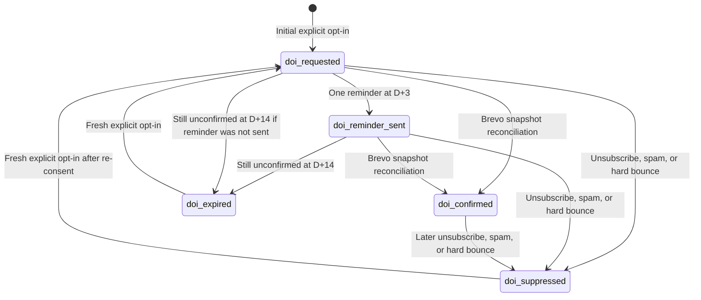

# Marketing DOI Lifecycle and Reconciliation Design

## Purpose

Provide an app-driven, auditable double-opt-in (DOI) lifecycle for SightSinger
marketing email. The design adds one narrowly controlled confirmation reminder,
keeps confirmed users out of the pending workflow, and records Brevo outcomes in
Firestore without relying on a browser redirect as proof of consent.

This is a design document only. It does not authorize an email campaign or a
production data change.

## Current Baseline

The authenticated marketing opt-in endpoint calls Brevo's DOI endpoint:

```text
POST /v3/contacts/doubleOptinConfirmation
```

The request supplies the configured list ID, DOI template ID, and redirect URL.
Brevo processes the confirmation link and adds a confirmed contact to the
configured list. The app currently records only:

```text
marketing.emailOptInRequested = true
marketing.emailOptInRequestedAt
marketing.emailOptInBrevoStatus = "doi_requested"
```

The production redirect URL is `https://sightsinger.app/waitlist/confirmed`.
It is currently a static success page: it neither calls the backend nor updates
Firestore. It is not a trusted confirmation callback and must not be used as
one.

There is also no current Brevo webhook handler or scheduled reconciliation, so
a user who has confirmed in Brevo can remain `doi_requested` in Firestore.

Relevant implementation files are:

- `src/backend/marketing_opt_in.py`
- `src/backend/waitlist.py`
- `src/backend/main.py`
- `marketing/app/waitlist/confirmed/page.tsx`

## Goals

- Keep Brevo as the provider that verifies DOI confirmation.
- Use `marketing.emailOptInBrevoStatus` as the sole DOI lifecycle state.
- Send at most one reminder after the initial DOI email.
- Mark a still-unconfirmed request expired after a defined window.
- Treat a scheduled full Brevo contact snapshot as the V1 source of truth and
  maintain Firestore as its local lifecycle projection.
- Use the existing Brevo API key at runtime, not an interactive Brevo account
  or OAuth user login.
- Prevent marketing sends to pending, expired, or suppressed contacts.

## Non-Goals

- Treating a visit to `/waitlist/confirmed` as confirmation.
- Using Brevo Automation for this flow.
- Sending a marketing campaign to pending DOI contacts.
- Sending more than one automated or user-initiated reminder in a DOI attempt.
- Maintaining a persistent local mirror of all Brevo contacts.

## Lifecycle



`doi_confirmed` is a historical confirmation fact. If the contact is later
suppressed, the status changes to `doi_suppressed`, while `ConfirmedAt` retains
proof that the earlier DOI cycle completed.

## Status Rules

`marketing.emailOptInBrevoStatus` uses only these values:

```text
doi_requested
doi_reminder_sent
doi_confirmed
doi_expired
doi_suppressed
```

Rules for beginning a DOI request:

| Current status | New DOI request |
| --- | --- |
| Missing | Start initial DOI request. |
| `doi_requested` | Do not start a new cycle or send another generic request. Return that confirmation is already pending. |
| `doi_reminder_sent` | Do not send again. |
| `doi_confirmed` | Do not send again; the user is already confirmed. |
| `doi_expired` | Allow a new DOI request only after fresh explicit opt-in. |
| `doi_suppressed` | Do not send automatically. Allow a new DOI request only after a fresh explicit opt-in that re-establishes consent. |

An explicit user-facing `Resend confirmation email` action is permitted only
while the status is `doi_requested`. It consumes the single allowed reminder:
it sends a DOI request and changes the status to `doi_reminder_sent`. The
scheduled job must then not send another reminder.

Each fresh explicit opt-in creates a new UUID `emailOptInBrevoCycleId`. Scheduler
updates must verify that the cycle ID still matches the one they read before
changing status. This prevents an old worker from expiring or otherwise
modifying a newer DOI request.

## Firestore Data Model

Retain existing fields and add the following fields under `marketing`:

```text
emailOptInBrevoStatus: doi_requested | doi_reminder_sent | doi_confirmed | doi_expired | doi_suppressed
emailOptInBrevoCycleId: UUID
emailOptInBrevoOriginalRequestedAt: Timestamp
emailOptInBrevoInitialDoiSentAt: Timestamp
emailOptInBrevoReminderSentAt: Timestamp | null
emailOptInBrevoNextActionAt: Timestamp | null
emailOptInBrevoExpiresAt: Timestamp | null
emailOptInBrevoConfirmedAt: Timestamp | null
emailOptInBrevoSuppressedAt: Timestamp | null
emailOptInBrevoSuppressionReason: string | null
emailOptInBrevoLastProviderOutcome: string
emailOptInBrevoReminderClaimedAt: Timestamp | null
```

The fields have these meanings:

- `CycleId` identifies one DOI attempt. Generate a new value only for a fresh
  explicit opt-in after expiry or suppression.
- `OriginalRequestedAt` is the user's original affirmative opt-in time. Never
  overwrite it when sending a reminder.
- `InitialDoiSentAt` and `ReminderSentAt` record provider-accepted sends.
- `NextActionAt` drives the scheduler. It is `original + 3 days` after the
  initial request, `expiresAt` after the reminder, and `null` for terminal
  statuses.
- `ExpiresAt` is `original + 14 days`.
- `ConfirmedAt` is the time the scheduler observes Brevo confirmation in its
  authoritative snapshot.
- Suppression fields explain why the status is `doi_suppressed` and preserve
  confirmation history when a previously confirmed contact later opts out.
- `ReminderClaimedAt` is a short-lived scheduler lease used to avoid two
  workers sending the same one allowed reminder.

The existing `emailOptInRequestedAt`, source, email, and consent-text fields
remain the consent-evidence record. Add a consent-text version field before
implementation if the product does not already maintain one.

## Timing and Message Policy

The proposed timings are:

| Event | Timing | Effect |
| --- | --- | --- |
| Initial DOI email | Immediate after explicit opt-in | `doi_requested` |
| Single reminder | Three days after original request | `doi_reminder_sent` |
| Expiry | Fourteen days after original request | `doi_expired` |

The maximum is two DOI messages per request: the original email and one
reminder. The reminder must be a consent-confirmation message only. It must
not contain product promotions, offers, newsletters, or other marketing
content. It should identify SightSinger, restate the requested subscription,
link to the privacy notice, and state that the recipient can ignore it if they
did not request updates.

Any automatic reminder policy must receive privacy-counsel approval before
launch. UK PECR and EU ePrivacy rules generally require prior consent for
marketing email; the soft opt-in is a separate, narrow exception and must not
be assumed for pending DOI contacts.

Sources:

- https://ico.org.uk/for-organisations/direct-marketing-and-privacy-and-electronic-communications/guidance-on-direct-marketing-using-electronic-mail/how-do-we-comply-with-the-pecr-electronic-mail-marketing-rules/
- https://eur-lex.europa.eu/legal-content/EN/TXT/?uri=CELEX%3A02002L0058-20091219

## Brevo Integration

### DOI send and resend

Use the existing Brevo DOI API endpoint and configured values:

```text
POST /v3/contacts/doubleOptinConfirmation
includeListIds: [BREVO_WAITLIST_LIST_ID]
templateId: BREVO_DOI_TEMPLATE_ID
redirectionUrl: BREVO_DOI_REDIRECT_URL
```

`includeListIds` controls which list Brevo adds the contact to after DOI
confirmation. The confirmation CTA itself must be Brevo's DOI link; the
redirect URL only chooses the post-confirmation landing page.

The reminder implementation must preserve the original consent-request data.
It must not overwrite an original consent date with the reminder send time.

Before implementation, run a controlled test using an internal pending contact
to prove that a second DOI API call sends a fresh usable confirmation email.
Brevo's `already exists` response is not sufficient proof that a reminder was
sent. Record it as an ambiguous provider outcome and reconcile before deciding
whether the sole reminder has been consumed.

### Scheduled reconciliation: V1 source of truth

V1 does not implement Brevo webhooks. The scheduled full Brevo contact snapshot
is the source of truth for DOI confirmation and suppression status. Firestore is
the local projection used by the app and by future marketing audience queries.

This means confirmation or suppression can take up to one scheduler interval to
appear in Firestore. The production schedule is daily in V1.

At the start of each run, fetch the full Brevo contact account once, paginating
in memory:

```text
GET /v3/contacts?limit=1000&offset=0
GET /v3/contacts?limit=1000&offset=1000
...
```

Build an in-memory map keyed by normalized email address. Each value needs only:

```text
attributes.DOUBLE-OPT-IN
listIds
emailBlacklisted
listUnsubscribed
```

`DOUBLE-OPT-IN` is retained as a diagnostic/corroborating attribute only. The
Contacts API can omit it for an existing confirmed contact, so V1 must not
require it to classify a user as confirmed.

Do not persist this map and do not log its raw email addresses. It is discarded
at the end of the run.

The existing production API key was verified with read-only requests to list
contacts and their attributes. It can perform this work without an interactive
Brevo administrator or OAuth user session. The job needs the key from Secret
Manager, not a human account.

Brevo contact API references:

- https://developers.brevo.com/reference/get-contacts
- https://developers.brevo.com/reference/get-contact-info

## Scheduler Algorithm

The scheduler runs daily. V1 uses Cloud Scheduler to invoke a private internal
route on the existing `sightsinger-billing-api` Cloud Run service. It must use the same
Brevo API key as the existing DOI flow.

1. Fetch all Brevo contacts into the one-run in-memory map. If any page fails,
   fail closed: send no reminder and expire no records.
2. Query all Firestore records whose status is `doi_requested` or
   `doi_reminder_sent`, regardless of `NextActionAt`.
3. For each active record, look up the normalized email in the snapshot and
   reconcile its state:

| Brevo snapshot result | Firestore action |
| --- | --- |
| Contact is email-blacklisted or unsubscribed from the DOI final list | Set `doi_suppressed` and suppression fields; clear `NextActionAt`; do not send. |
| Contact belongs to the DOI-only final list | Set `doi_confirmed`; clear `NextActionAt`. Record `DOUBLE-OPT-IN` when present as corroborating evidence. |
| No contact, or contact is not in the DOI-only final list | Continue pending workflow. |

4. From the remaining active records, select only those with
   `emailOptInBrevoNextActionAt <= now` for a due action.
5. If a due `doi_requested` record is at least three days old, claim the
   reminder in a Firestore transaction. The transaction must verify the status,
   unchanged `CycleId`, and unchanged `OriginalRequestedAt`, then set a short
   lease in `ReminderClaimedAt`.
6. Call Brevo for the one reminder. On an unambiguous accepted send, set
   `doi_reminder_sent`, `ReminderSentAt`, and `NextActionAt = ExpiresAt`.
7. If the external API times out after the request may have been accepted, set
   `LastProviderOutcome = unknown_delivery` and do not automatically retry.
   The next run must reconcile Brevo rather than risk sending a duplicate
   reminder.
8. If a due pending record reaches `ExpiresAt`, set `doi_expired`,
   clear `NextActionAt`, and send no email.

The job processes the Brevo snapshot immediately after fetching it. A user can
technically confirm between the snapshot and a reminder send; this is a small
accepted staleness window for the one-snapshot design. At the current contact
volume the run should complete quickly. If the list grows materially or the
risk becomes unacceptable, add a per-candidate final read before sending.

## V1 Source-of-Truth Interaction

```text
Brevo DOI confirmation or suppression
    -> Brevo contact record changes
    -> Daily scheduler fetches full contact snapshot
    -> Firestore status becomes doi_confirmed or doi_suppressed
```

Webhooks are explicitly out of scope for V1. They can be added later to reduce
confirmation latency, but the scheduled reconciliation remains the V1 source
of truth and should remain as a fallback when webhooks are introduced.

The confirmation landing page remains presentation-only. It must not mutate
the DOI status merely because a browser loaded it.

## Deployment Component Design

### Components

V1 uses these production components:

```text
Cloud Scheduler job: marketing-doi-reconcile
  -> OIDC-authenticated POST
Cloud Run service: sightsinger-billing-api
  -> POST /internal/marketing/doi-reconcile
Backend reconciler module
  -> Firestore users collection
  -> Secret Manager: BREVO_WAITLIST_API_KEY
  -> Brevo Contacts API and DOI API
```

No new Firebase Function, Firebase Functions codebase, public HTTP endpoint, or
Brevo Automation workflow is part of V1.

### Cloud Scheduler Job

Create one Cloud Scheduler HTTP job named `marketing-doi-reconcile` in the
configured scheduler region. It runs once per day on an explicit UTC schedule;
the initial recommended schedule is `15 03 * * *` with time zone `Etc/UTC`.

The job configuration must include:

```text
HTTP method: POST
URI: https://<sightsinger-billing-api-url>/internal/marketing/doi-reconcile
OIDC service account: sightsinger-doi-scheduler@sightsinger-app.iam.gserviceaccount.com
OIDC audience: https://<sightsinger-billing-api-url>
Retry policy: no automatic retry attempts
```

The dedicated caller service account has only `roles/run.invoker` on
`sightsinger-billing-api`. It has no Firestore, Secret Manager, or Brevo permissions.
No scheduled retry is intentional: a timeout after an external Brevo send must
be reconciled, not blindly replayed. The next regular run remains safe because
the reconciler uses Firestore leases and provider outcomes.

### Cloud Run Internal Route

Add a non-user-facing route to `sightsinger-billing-api`:

```text
POST /internal/marketing/doi-reconcile
```

The route is not a Firebase-user endpoint. It accepts only a Google OIDC token
for the scheduler caller service account and validates:

- token signature and expiry;
- audience equals the configured `sightsinger-billing-api` service URL; and
- caller email equals the configured scheduler service account.

If the Cloud Run service is publicly invokable for existing user APIs, this
application-level check remains mandatory for this route. If Cloud Run IAM is
made private later, retain the check as defense in depth.

`billing_api.py` currently applies Firebase App Check to all routes except a
small explicit allowlist. Add only this exact internal route to that allowlist,
then require Scheduler OIDC authentication inside the route. Do not disable App
Check globally or create a broad `/internal/*` App Check exception.

The route creates a `run_id`, acquires a global Firestore run lease, executes
the reconciliation, writes structured logs/metrics, and returns a compact JSON
summary. A second invocation while the lease is live returns an explicit
`already_running` result without performing any Brevo action.

### Runtime Identity and Permissions

The existing `sightsinger-billing-api-as@sightsinger-app.iam.gserviceaccount.com`
Cloud Run runtime service account performs the work. It needs only:

```text
roles/datastore.user
roles/secretmanager.secretAccessor on BREVO_WAITLIST_API_KEY
```

It does not need a Brevo browser login, OAuth token, or a human administrator
account. The backend retrieves the existing API key from Secret Manager and
uses it for all Brevo reads and DOI sends.

### Co-location Tradeoffs

Running this workload on `sightsinger-billing-api` is appropriate for V1:

- The reconciler is CPU/network bound, requires no GPU, and runs once per day.
- The billing service already uses request-based Cloud Run scaling with
  `min-instances=0`, so no separate idle service is required.
- The service already has Firestore and Secret Manager integration patterns.

The accepted tradeoffs and controls are:

| Risk | V1 control |
| --- | --- |
| Marketing deployment affects the billing service revision. | Keep the feature disabled by default, lazily initialize the reconciler, and run billing API smoke tests on every deploy. |
| A slow reconciliation shares CPU/memory with checkout and webhook requests. | Daily off-peak schedule, global run lease, 500-record cap, 300-second timeout, and structured duration metrics. Cloud Run may scale another instance when needed. |
| The billing runtime gains access to the Brevo key in addition to Stripe secrets. | Grant access only to the specific Brevo secret, retain least-privilege IAM, and redact provider credentials and email addresses from logs. |
| The billing image currently lacks the HTTP client used by the marketing DOI code. | Add and pin `httpx` in `requirements-billing.txt` with the implementation. |

Split this into a dedicated marketing Cloud Run service when scheduled runtime,
contact volume, Brevo API rate limiting, or billing-request latency makes the
shared service materially risky. The reconciler module should remain independent
of billing business logic so that split is a deployment change rather than a
behavioral rewrite.

### Configuration

Externalize the V1 controls in `env/prod.env` and load them through the backend
settings layer:

```text
MARKETING_DOI_RECONCILE_ENABLED=false
MARKETING_DOI_RECONCILE_MODE=observe
MARKETING_DOI_RECONCILE_SCHEDULE=30 03 * * *
MARKETING_DOI_REMINDER_DELAY_DAYS=3
MARKETING_DOI_EXPIRY_DAYS=14
MARKETING_DOI_MAX_ACTIVE_USERS=500
MARKETING_DOI_SCHEDULER_SERVICE_ACCOUNT=sightsinger-doi-scheduler@sightsinger-app.iam.gserviceaccount.com
MARKETING_DOI_SCHEDULER_AUDIENCE=https://<sightsinger-billing-api-url>
```

`observe` performs the Brevo snapshot and Firestore status reconciliation but
does not call the DOI API to send reminders and does not expire records.
`send` permits the one-reminder and expiry transitions after approval.

`BREVO_WAITLIST_API_KEY`, `BREVO_WAITLIST_LIST_ID`,
`BREVO_DOI_TEMPLATE_ID`, and `BREVO_DOI_REDIRECT_URL` remain the provider
configuration for both the existing initial DOI request and the scheduler. The
reconciler derives its final DOI list ID directly from `BREVO_WAITLIST_LIST_ID`
to avoid duplicated configuration.

### Deployment Sequence

1. Add the reconciler module, internal route, settings, tests, and structured
   metrics to the billing backend image.
2. Add `httpx` to `requirements-billing.txt`; the current billing image does
   not include the HTTP client used by the existing Brevo integration. Update
   the billing deployment configuration to use a 300-second Cloud Run request
   timeout instead of the current 60 seconds.
3. Build and deploy `sightsinger-billing-api` using
   `scripts/build_billing_backend_prod.sh` and
   `scripts/deploy_billing_backend_prod.sh`. Keep
   `MARKETING_DOI_RECONCILE_ENABLED=false` initially.
4. Create the dedicated Scheduler caller service account and grant it only
   Cloud Run Invoker on `sightsinger-billing-api`.
5. Grant the billing runtime service account Secret Manager access to
   `BREVO_WAITLIST_API_KEY` if it does not already have that secret-level
   permission.
6. Create or update the `marketing-doi-reconcile` Scheduler job with its OIDC
   caller and no automatic retries.
7. Enable `observe` mode, force-run the job, and verify the snapshot, status
   reconciliation, OIDC verification, run lease, and zero-send metrics.
8. Complete the pending-contact resend capability test and receive
   privacy-counsel approval of the reminder policy.
9. Change to `send` mode, deploy the configuration, and monitor the first
   scheduled runs.

Provide an idempotent deployment script such as
`scripts/deploy_marketing_doi_reconcile_prod.sh`. It must update the scheduler
job after the backend route is deployed, never echo the Brevo API key, and
support both initial job creation and subsequent updates.

### Deployment Verification

After deployment, verify:

```text
Billing Cloud Run revision serving the internal route
Scheduler job OIDC service account and audience
Scheduler job next-run time and zero automatic retries
Cloud Run Invoker binding for the scheduler service account on sightsinger-billing-api
Billing runtime Secret Manager access to BREVO_WAITLIST_API_KEY
Forced observe-mode run returns a successful compact summary
No DOI email sent while mode is observe
```

## Security and Privacy

- Keep `BREVO_WAITLIST_API_KEY` in Secret Manager. Grant the
  `sightsinger-billing-api`
  runtime service account only `secretmanager.secretAccessor` for that secret,
  Firestore access required by the job, and outbound HTTPS access. Grant the
  Scheduler caller service account only Cloud Run Invoker.
- Treat the Brevo API key as an account-level credential. Do not expose it to
  the browser, scripts run by users, or logs.
- Use private scheduler invocation with a dedicated service account.
- Redact emails from application logs; log a UID or a stable non-reversible
  correlation value instead.
- Never add `doi_requested`, `doi_reminder_sent`, `doi_expired`, or
  `doi_suppressed` users to a marketing campaign audience.
- Keep only the minimum consent evidence and suppression record required by
  the approved retention policy.

## Observability

Log one structured result per run with:

```text
run_id
brevo_snapshot_contact_count
firestore_candidates_scanned
confirmed_reconciled
suppressed_reconciled
reminders_sent
expired
skipped_not_due
skipped_lease_held
provider_failures
unknown_delivery
has_more_candidates
```

Alert on a failed Brevo snapshot, any unexpected provider response, and an
abnormal increase in unknown deliveries or suppression events.

## Data Migration and Rollout

1. Implement and deploy the snapshot reconciler in observation-only mode.
2. Reconcile all existing `doi_requested` and `doi_reminder_sent` records
   against Brevo. Mark confirmed
   users as `doi_confirmed`; do not send reminders during this step.
3. Confirm the final list is DOI-only and that its membership maps reliably to
   Firestore users. Do not rely on `DOUBLE-OPT-IN` being present in the Contacts
   API response.
4. Complete the controlled resend test and obtain privacy-counsel approval for
   the reminder content and timings.
5. Enable one-reminder sends behind a feature flag.
6. Review the first production runs and Brevo logs before removing the flag.

## Test Plan

- Initial explicit opt-in creates `doi_requested` and schedules D+3.
- Repeated generic opt-in while pending sends no email and preserves the
  original timestamp.
- Explicit resend sends exactly once and changes status to
  `doi_reminder_sent`.
- Scheduler sends exactly one reminder at D+3.
- Confirmed contact in the Brevo snapshot becomes `doi_confirmed` with no
  reminder.
- A contact in the DOI-only final list with no `DOUBLE-OPT-IN` attribute still
  becomes `doi_confirmed`.
- Blacklisted or unsubscribed contact is suppressed with no reminder.
- Unconfirmed record expires at D+14 and cannot be reminded again.
- Fresh explicit opt-in after expiry starts a new request.
- Failed snapshot prevents both reminders and expiries.
- Timeout after Brevo call produces `unknown_delivery` without an automatic
  duplicate send.
- Concurrent workers cannot both claim the one reminder.
- Scheduler reconciliation is idempotent and does not regress `doi_confirmed`
  or `doi_suppressed` to a pending status.

## Open Preconditions

- Privacy counsel approval of the single non-promotional reminder policy.
- Confirmation that the Brevo DOI endpoint can send a fresh confirmation email
  for a pending existing contact.
- A DOI-only final Brevo list. If other ingestion paths can add contacts to the
  list, create a separate DOI-only final list before enabling V1; an optional
  `DOUBLE-OPT-IN` attribute is not a sufficient substitute.
- Audit whether the current `BREVO_WAITLIST_LIST_ID=3` Waiting List satisfies
  the DOI-only final-list requirement before using it as the V1 authority.
- Final retention periods for pending, expired, and suppressed consent records.
