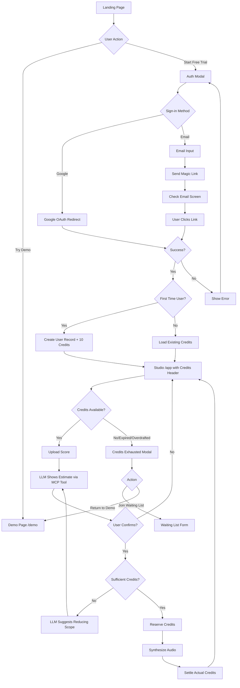

# Free Trial Feature - Implementation Plan

This document outlines the implementation plan for the Free Trial system including authenticated sign-in, credit-based usage tracking, and waiting list functionality.

---

## Goals

1. **Authentication**: Allow users to sign in via Google Account (redirect) or Email Magic Link
2. **Free Trial Credits**: Grant 10 credits (30 seconds each = 300 seconds total) on first sign-in, expiring in 7 days
3. **Waiting List**: Allow signed-in users to join a waiting list for future features/capacity

---

## Design Decisions (Confirmed)

| Decision | Choice |
|----------|--------|
| Google Sign-In | Full-page redirect flow for all platforms (`signInWithRedirect`) |
| Email Auth | Firebase `sendSignInLinkToEmail` |
| Auth Methods | Both available |
| Credit Estimation | MCP tool returns server-derived estimate + current/projected balance; LLM must present and ask confirmation |
| Credit Reservation | Must reserve estimated credits before synthesis; reject if `estimated_credits > available_balance` |
| Credit Consumption | Deduct actual credits based on server-derived audio duration (`ceil(seconds / 30)`) |
| Overdraft Rule | If balance becomes negative after settlement, account is permanently locked until balance ≥ 0 |
| Credit Expiry | Mark as expired (not deleted); expiry is locked at reservation time for in-flight jobs |
| Reservation TTL | Same as session duration |
| Synthesis Timeout | 900 seconds (matches request timeout); releases reservation on timeout |
| Insufficient Credits | Reject synthesis; user must instruct LLM to reduce scope (e.g., skip repeats) |
| Paid Plans | Free trial only for now |

> [!NOTE]
> **Waiting List Form**: Design TBC - awaiting further input.

---

## UI Flow



---

## UI Design Specifications

### 1. Auth Modal Component

**Trigger**: "Start Free Trial" button on landing page and `/app` route protection

```
┌──────────────────────────────────────────┐
│              ✕ Close                     │
├──────────────────────────────────────────┤
│                                          │
│        ✨ Start Your Free Trial          │
│                                          │
│   Get 10 credits (5 minutes of audio)    │
│        Valid for 7 days                  │
│                                          │
├──────────────────────────────────────────┤
│                                          │
│   ┌──────────────────────────────────┐   │
│   │  🔵 Continue with Google         │   │
│   └──────────────────────────────────┘   │
│                                          │
│         ─────── or ───────               │
│                                          │
│   ┌──────────────────────────────────┐   │
│   │  Email address                   │   │
│   └──────────────────────────────────┘   │
│                                          │
│   ┌──────────────────────────────────┐   │
│   │  📧 Send Magic Link              │   │
│   └──────────────────────────────────┘   │
│                                          │
│   By continuing, you agree to our        │
│   Terms of Service and Privacy Policy    │
│                                          │
└──────────────────────────────────────────┘
```

**Design Tokens**:
- Background: Semi-transparent dark overlay (`#000000` 50% opacity)
- Modal: Dark card with border (`var(--card-bg)`, `var(--border-color)`)
- Primary button (Google): Gradient accent (`var(--accent-gradient)`)
- Secondary button (Email): Outline style
- Border radius: 12px for modal, 8px for buttons

---

### 2. Credits Header Component (Studio)

**Location**: Fixed header bar in `/app` (MainApp)

```
┌─────────────────────────────────────────────────────────────┐
│ ✨ SightSinger.ai          CREDITS: 8/10 │ 5d 12h remaining │
└─────────────────────────────────────────────────────────────┘
```

**States**:
| State | Condition | Style |
|-------|-----------|-------|
| Normal | > 2 credits | Green accent |
| Low | ≤ 2 credits | Yellow/amber warning |
| Expired/Empty | 0 credits or expired | Red, "Credits Exhausted" |

---

### 3. Credit Cost Estimation (Pre-Generation)

**Location**: Chat response from LLM (not a modal/system dialog)

Example chat response (sufficient credits):
```
Assistant:
Estimated duration: ~2 min 30 sec
Estimated cost: 5 credits
Your balance: 8 credits
Balance after generation: 3 credits

Would you like me to proceed with the render?
```

Example chat response (insufficient credits):
```
Assistant:
Estimated duration: ~5 min
Estimated cost: 10 credits
Your balance: 3 credits

You don't have enough credits for this render. Would you like me to:
- Sing only the first verse?
- Skip the repeat sections?
- Generate a shorter excerpt?
```

---

### 4. Magic Link Sent Screen

```
┌──────────────────────────────────────────┐
│                                          │
│           📬 Check Your Email            │
│                                          │
│   We sent a sign-in link to:             │
│   example@email.com                      │
│                                          │
│   Click the link in your email to        │
│   complete sign-in.                      │
│                                          │
│   Didn't receive it?                     │
│   [Resend Link] [Try Different Email]    │
│                                          │
└──────────────────────────────────────────┘
```

---

### 5. Credits Exhausted Modal

```
┌──────────────────────────────────────────┐
│                                          │
│        ⏰ Free Trial Ended               │
│                                          │
│   You've used all your free trial        │
│   credits. Paid plans coming soon!       │
│                                          │
│   ┌──────────────────────────────────┐   │
│   │  🔔 Join Waiting List            │   │
│   └──────────────────────────────────┘   │
│                                          │
│   [Return to Demo]                       │
│                                          │
└──────────────────────────────────────────┘
```

---

### 6. Waiting List Form (TBC)

> [!NOTE]
> Design pending further input from user.

---

## Proposed Changes

### Frontend (`ui/`)

---

#### [MODIFY] [firebase.ts](file:///Users/alanchan/antigravity/ai-singer-diffsinger/ui/src/firebase.ts)

Implement Google Sign-In (redirect-only) and Email Magic Link authentication. See `authentication_design_spec.md` for technical details.

---

#### [NEW] [components/AuthModal.tsx](file:///Users/alanchan/antigravity/ai-singer-diffsinger/ui/src/components/AuthModal.tsx)

Modal for Google/Email authentication with states: `idle`, `sendingEmail`, `emailSent`, `signingIn`, `error`. See `authentication_design_spec.md` for the auth flow details.

---

#### [NEW] [components/CreditsHeader.tsx](file:///Users/alanchan/antigravity/ai-singer-diffsinger/ui/src/components/CreditsHeader.tsx)

Header showing credit balance with normal/low/exhausted states.

---

#### [NEW] [components/CreditsExhaustedModal.tsx](file:///Users/alanchan/antigravity/ai-singer-diffsinger/ui/src/components/CreditsExhaustedModal.tsx)

Modal for exhausted/expired credits with waiting list CTA.

---

#### [NEW] [components/WaitingListForm.tsx](file:///Users/alanchan/antigravity/ai-singer-diffsinger/ui/src/components/WaitingListForm.tsx)

Form for joining waiting list (design TBC).

---

#### [NEW] [hooks/useAuth.ts](file:///Users/alanchan/antigravity/ai-singer-diffsinger/ui/src/hooks/useAuth.ts)

React hook for auth state; details in `authentication_design_spec.md`.

---

#### [NEW] [hooks/useCredits.ts](file:///Users/alanchan/antigravity/ai-singer-diffsinger/ui/src/hooks/useCredits.ts)

React hook for credit state from Firestore.

---

#### [MODIFY] [App.tsx](file:///Users/alanchan/antigravity/ai-singer-diffsinger/ui/src/App.tsx)

Add auth context and route protection for `/app`.

---

#### [MODIFY] [LandingPage.tsx](file:///Users/alanchan/antigravity/ai-singer-diffsinger/ui/src/landing/LandingPage.tsx)

Add "Start Free Trial" button that opens AuthModal.

---

#### [MODIFY] [MainApp.tsx](file:///Users/alanchan/antigravity/ai-singer-diffsinger/ui/src/MainApp.tsx)

- Add CreditsHeader
- Refresh credit state after generation completes
- Show CreditsExhaustedModal when depleted

---

### Backend (`src/backend/`)

---

#### [NEW] [credits.py](file:///Users/alanchan/antigravity/ai-singer-diffsinger/src/backend/credits.py)

Backend credit module implementing estimate, reserve, settle, release, and ledger logging. See `credit_system_design_spec.md` for technical details.

---

#### [NEW] [waiting_list.py](file:///Users/alanchan/antigravity/ai-singer-diffsinger/src/backend/waiting_list.py)

Waiting list module with deterministic document IDs (`waiting_list/{uid}`) to enforce uniqueness.

---

#### [MODIFY] [main.py](file:///Users/alanchan/antigravity/ai-singer-diffsinger/src/backend/main.py)

Internal integration points:

- Credit reservation + settlement handled inside synthesize job flow.
- `estimate_credits` exposed as an MCP tool for the LLM before synthesis.
- Synthesis timeout: 900 seconds - releases reservation if exceeded.
- Waiting list endpoint remains public (`POST /waiting-list`).
- Update LLM system prompt to require `estimate_credits` before `synthesize`, and to ask for user confirmation.

MCP Tool: `estimate_credits` (see `credit_system_design_spec.md` for payload details).

---

### Firestore Schema

---

#### Collection: `users/{uid}`

```json
{
  "email": "user@example.com",
  "displayName": "User Name",
  "createdAt": "2026-01-15T00:00:00Z",
  "credits": {
    "balance": 8,
    "reserved": 0,
    "expiresAt": "2026-01-22T00:00:00Z",
    "overdrafted": false,
    "trialGrantedAt": "2026-01-15T00:00:00Z"
  }
}
```

---

#### Collection: `waiting_list/{uid}`

```json
{
  "userId": "abc123",
  "email": "user@example.com",
  "interests": ["more_credits", "more_voices"],
  "joinedAt": "2026-01-15T00:00:00Z",
  "status": "pending"
}
```
Note: use deterministic document IDs (`waiting_list/{uid}`) to enforce uniqueness.

---

### Security Rules

#### [MODIFY] [firestore.rules](file:///Users/alanchan/antigravity/ai-singer-diffsinger/firestore.rules)

```javascript
rules_version = '2';

service cloud.firestore {
  match /databases/{database}/documents {

    match /users/{uid} {
      allow read: if request.auth != null && request.auth.uid == uid;
      allow write: if false; // server-only credit updates
    }

    match /jobs/{jobId} {
      allow create: if request.auth != null
                    && request.resource.data.userId == request.auth.uid;
      allow read, update, delete: if request.auth != null
                    && resource.data.userId == request.auth.uid;
    }

    match /waiting_list/{entryId} {
      allow create, update: if request.auth != null
                    && entryId == request.auth.uid
                    && request.resource.data.userId == request.auth.uid;
      allow read: if request.auth != null
                  && resource.data.userId == request.auth.uid;
    }

    match /credit_reservations/{jobId} {
      allow read, write: if false; // server-only via Admin SDK
    }

    match /credit_ledger/{entryId} {
      allow read, write: if false; // server-only via Admin SDK
    }
  }
}
```

---

## Verification Plan

### Backend Tests

```bash
pytest tests/test_credits.py -v
```

Test cases:
- `test_create_credits_for_new_user` - 10 credits allocated, expires in 7 days
- `test_estimate_credits` - Returns estimate + balance info, ceil(duration/30)
- `test_reserve_credits_success` - Atomically reserves credits
- `test_reserve_credits_insufficient` - Raises error when estimated > available
- `test_settle_credits` - Deducts actual credits, may overdraft
- `test_release_credits` - Releases reservation on failure/cancel
- `test_overdraft_lockout` - Blocks new synthesis when overdrafted
- `test_reservation_timeout` - Releases after 900s

---

### Manual Verification

| Test | Steps | Expected |
|------|-------|----------|
| Google Sign-In | Landing → "Start Free Trial" → "Continue with Google" | Redirects to Google, returns to `/app` with 10 credits |
| Email Magic Link | Enter email → Click email link | Redirects to `/app` with 10 credits |
| Credit Estimate | Upload score | Shows estimated cost before generation |
| Credit Consumption | Generate audio | Actual credits deducted based on duration |
| Credits Exhausted | Use all credits → Try generate | Shows exhausted modal |
| Waiting List | From exhausted modal → Join | Success confirmation |

---

## Implementation Order

1. **Phase 1: Auth Infrastructure** - `firebase.ts`, AuthModal, useAuth hook, route protection (see `authentication_design_spec.md`)
2. **Phase 2: Credits System** - Backend service, `estimate_credits` MCP tool, useCredits hook, CreditsHeader (see `credit_system_design_spec.md`)
3. **Phase 3: Integration** - MainApp credit check/consume, LLM estimate flow, CreditsExhaustedModal
4. **Phase 4: Waiting List** - Backend service, API endpoint, WaitingListForm (pending design)
