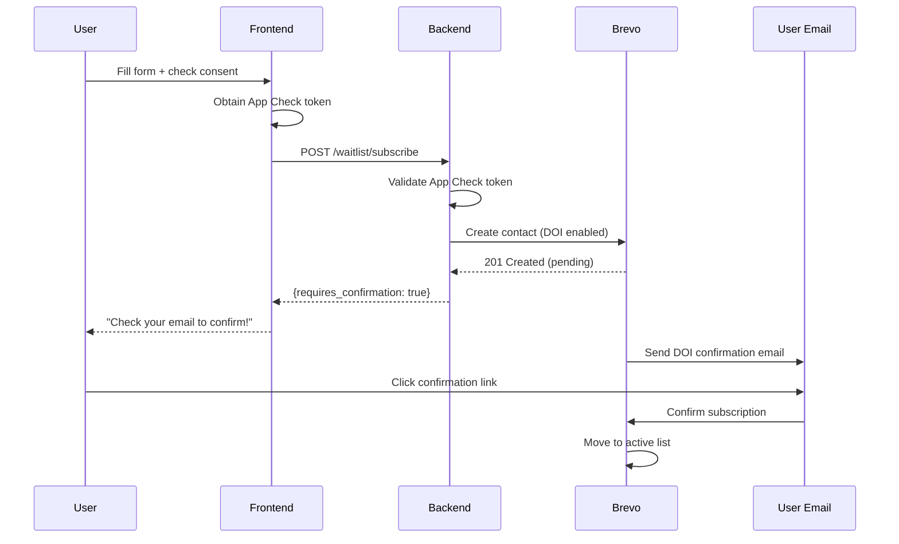
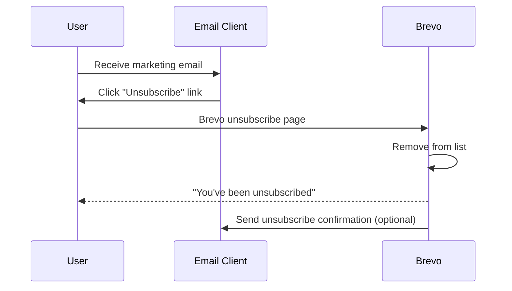

# Waiting List Feature Specification

> **Version 2.0** | SightSinger.ai
> GDPR-compliant waiting list with Double Opt-in, Firebase App Check, and Brevo integration.

---

## 1. Overview

### Goal
Allow users to join a waiting list to receive:
- Updates on the paid subscription plan launch
- Marketing communications and product updates
- Early access or beta invitations

### Key Features
- ✅ **Double Opt-in** — Brevo sends confirmation email
- ✅ **Firebase App Check** — Use the existing App Check token (reCAPTCHA v3 provider)
- ✅ **Pre-filled Email** — Auto-fill for authenticated users
- ✅ **Unsubscribe Flow** — Managed by Brevo email templates

### Email Service
- **Provider**: Brevo (formerly Sendinblue)
- **API Key**: GCP Secret Manager → `BREVO_WAITLIST_API_KEY`
- **Contact List**: Pre-created in Brevo dashboard

---

## 2. GDPR Compliance

### Consent Requirements
1. **Explicit Opt-in**: Checkbox unchecked by default
2. **Clear Purpose**: User understands what they're signing up for
3. **Separate Consent**: Marketing consent separate from account creation
4. **Audit Trail**: Store timestamp and consent text
5. **Double Opt-in**: Confirmation email before adding to active list

### Consent Text
```
☐ I agree to receive product updates, marketing emails, and announcements 
  about SightSinger.ai paid plans. I can unsubscribe at any time.
```

### Data Collected
| Field | Required | Purpose |
|-------|----------|---------|
| Email | Yes | Communication |
| First Name | No | Personalization |

---

## 3. Double Opt-in Flow



### Brevo Double Opt-in Setup
1. Go to **Contacts → Settings → Double Opt-in**
2. Enable DOI for your waiting list
3. Customize the confirmation email template
4. Set redirect URL after confirmation (optional)

---

## 4. UI Flow & Placements

### Entry Points

| Location | Trigger | Pre-fill Email |
|----------|---------|----------------|
| **Landing Page Footer** | Always visible | No |
| **Credits Exhausted Modal** | When credits = 0 | Yes (if logged in) |
| **Trial Expiration Notice** | When trial ends | Yes (if logged in) |

### UI Components

#### WaitingListForm Component
```
┌─────────────────────────────────────────────────┐
│  📬 Join the Waiting List                       │
├─────────────────────────────────────────────────┤
│  Email: [user@example.com_____________]  ← Pre-filled
│                                                 │
│  ☐ I agree to receive product updates,         │
│    marketing emails, and announcements about   │
│    SightSinger.ai paid plans.                  │
│    I can unsubscribe at any time.              │
│                                                 │
│  [   Join Waiting List   ]                      │
│                                                 │
│  🔒 Protected by Firebase App Check             │
└─────────────────────────────────────────────────┘
```

#### Success State (DOI)
```
┌─────────────────────────────────────────────────┐
│  ✉️ Check Your Email!                           │
├─────────────────────────────────────────────────┤
│  We've sent a confirmation email to:            │
│  user@example.com                               │
│                                                 │
│  Click the link in the email to confirm your   │
│  subscription.                                  │
└─────────────────────────────────────────────────┘
```

---

## 5. Firebase App Check Integration

### Frontend: Get Token from Firebase App Check

```text
Pseudocode (frontend waitlist request):
- Get App Check token from Firebase SDK (non-force refresh).
- POST /waitlist/subscribe with:
  - JSON body: email, first_name (optional), gdpr_consent, consent_text, source
  - Header: X-Firebase-AppCheck: <token>
- If response not OK, show a generic error.
- If OK, show “check your email” confirmation.
```

### Backend: Verify App Check Token

```text
Pseudocode (backend token verification):
- Call Firebase App Check verify_token(token).
- If verification fails, log a warning and return False.
- Otherwise return True.
```

---

## 6. Backend Implementation

### 6.1 Endpoint

| Method | Path | Auth | Headers |
|--------|------|------|---------|
| POST | `/waitlist/subscribe` | Public | `X-Firebase-AppCheck` required |

### 6.2 Request Schema

Request fields:
- email (required)
- first_name (optional)
- gdpr_consent (required, must be true)
- consent_text (required, exact text agreed to)
- source (required: landing | credits_exhausted | trial_expired)

### 6.3 Response Schema

Response fields:
- success (boolean)
- message (string)
- requires_confirmation (boolean, true when DOI is enabled)

### 6.4 Service: `src/backend/waitlist.py`

```text
Pseudocode (waitlist service):
- Read Brevo settings from config (list id, DOI template id, redirect URL).
- Fetch Brevo API key from Secret Manager (cache in memory).
- If gdpr_consent is false, return failure.
- Build Brevo DOI payload with email + attributes (consent text + timestamp + source).
- POST to Brevo DOI endpoint.
- If response is success or “already exists”, return success with generic message.
- Otherwise log warning and return failure.
```

### 6.5 Route: `src/backend/main.py`

```text
Pseudocode (route handler):
- Require X-Firebase-AppCheck header.
- If App Check verification fails, return 403.
- If gdpr_consent is false, return 400.
- Call waitlist service to create DOI request.
- If service fails, return 500 with generic message.
- Otherwise return success + requires_confirmation=true.
```

### 6.6 Configuration

Add to `src/backend/config/__init__.py`:

```text
Pseudocode (config):
- Load BREVO_WAITLIST_LIST_ID, BREVO_DOI_TEMPLATE_ID, BREVO_DOI_REDIRECT_URL
  from environment variables (with safe defaults for local dev).
```

---

## 7. Frontend Implementation

### 7.1 Pre-filled Email Component

```text
Pseudocode (WaitingListForm component):
- Pre-fill email if user is authenticated.
- Maintain state: first name, consent checkbox, status, and message.
- On submit:
  - If consent is false, show inline error and stop.
  - Call subscribeToWaitlist with email, first_name, gdpr_consent, consent_text, source.
  - On success, show “check your email” confirmation.
  - On failure, show generic error message.
```

---

## 8. Unsubscribe Flow

### How It Works
Unsubscribe is **fully managed by Brevo**. No code changes required in our app.



### Brevo Setup
1. **Unsubscribe Link**: Automatically added to all emails via `{{ unsubscribe }}` tag
2. **Unsubscribe Page**: Brevo-hosted, customizable in Settings
3. **Confirmation Email**: Optional, configure in Brevo dashboard

### Template Variables (for Brevo emails)
| Variable | Description |
|----------|-------------|
| `{{ contact.FIRSTNAME }}` | User's first name |
| `{{ unsubscribe }}` | Unsubscribe link |
| `{{ update_profile }}` | Preference center link |

### Our Integration Points
| Event | Brevo Handles | Our Code |
|-------|---------------|----------|
| Unsubscribe link click | ✅ | None |
| Remove from list | ✅ | None |
| Confirmation email | ✅ | None |
| Webhook (optional) | ✅ | Optional: log to analytics |

### Optional: Unsubscribe Webhook
If you want to track unsubscribes in your analytics:

```text
Pseudocode (optional Brevo webhook):
- Accept webhook payload.
- If event == unsubscribed, log or forward to analytics.
- Always return 200 OK.
```

---

## 9. Environment Variables

### Backend (Cloud Run)

| Variable | Description | Example |
|----------|-------------|---------|
| `BREVO_WAITLIST_LIST_ID` | Brevo contact list ID | `3` |
| `BREVO_DOI_TEMPLATE_ID` | Double opt-in email template ID | `1` |
| `BREVO_DOI_REDIRECT_URL` | URL after DOI confirmation | `https://sightsinger.ai/welcome` |
| `GCP_PROJECT_ID` | For Secret Manager | `sightsinger-prod` |

### Secrets (GCP Secret Manager)

| Secret Name | Description |
|-------------|-------------|
| `BREVO_WAITLIST_API_KEY` | Brevo API Key |

---

## 10. Brevo Contact Attributes

Create these in Brevo → Contacts → Settings → Contact Attributes:

| Attribute | Type | Description |
|-----------|------|-------------|
| `FIRSTNAME` | Text | First name (optional) |
| `SIGNUP_SOURCE` | Text | Where user signed up |
| `GDPR_CONSENT` | Boolean | Consent given |
| `GDPR_CONSENT_TEXT` | Text | Exact wording agreed to |
| `GDPR_CONSENT_DATE` | Date | Timestamp |

---

## 11. Testing Checklist

### Subscribe Flow
- [ ] Form validates email format
- [ ] Consent checkbox required
- [ ] reCAPTCHA token sent in header
- [ ] Backend validates App Check token
- [ ] Brevo receives contact with DOI
- [ ] User receives confirmation email
- [ ] Clicking confirm link activates subscription
- [ ] Pre-filled email for logged-in users

### Unsubscribe Flow
- [ ] Unsubscribe link in email works
- [ ] Brevo unsubscribe page loads
- [ ] User removed from list
- [ ] Confirmation shown to user

### Error Handling
- [ ] Invalid email shows error
- [ ] Missing consent shows error
- [ ] App Check verification failed returns 403
- [ ] Brevo API failure handled gracefully
- [ ] "Already subscribed" case handled

---

## 12. Implementation Order

1. **Brevo Setup**
   - Create DOI email template
   - Configure unsubscribe page
   - Note list ID and template ID

2. **Backend**
   - Add config variables
   - Create `waitlist.py` service
   - Add `/waitlist/subscribe` endpoint
   - Deploy to Cloud Run

3. **Frontend**
   - Create `WaitingListForm` component
   - Add API client with App Check
   - Integrate into Landing Page
   - Integrate into Credits Exhausted Modal

4. **Test**
   - Full subscribe flow
   - Unsubscribe flow
   - Error cases

---

## 13. Success/Error Messages

| Scenario | Message |
|----------|---------|
| Success (new or existing) | ✉️ If this email isn't already subscribed, you'll receive a confirmation shortly. |
| Missing consent | Please agree to receive updates to continue. |
| Invalid email | Please enter a valid email address. |
| App Check failed | Verification failed. Please try again. |
| API error | Something went wrong. Please try again later. |
